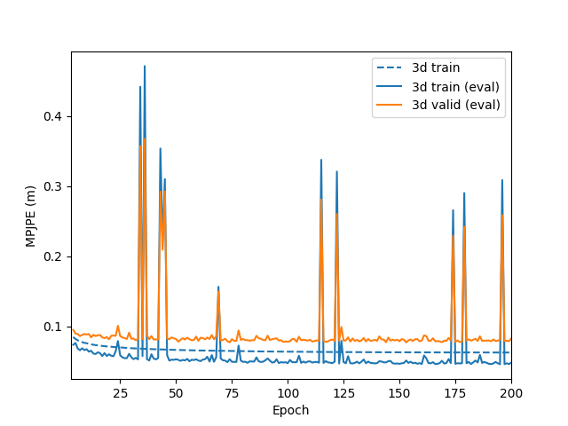

# MPI_INF_3DHP-on-VideoPose3D

## Instruction
Copy paste files to VideoPose3D directory.
The rest follows the same procedure as VideoPose3D
### Setup dataset
Go to [mpi_inf_3dhp website](http://vcai.mpi-inf.mpg.de/3dhp-dataset/) and follow the instruction to download the dataset, adn run the following
```bash
python prepare_data_mpi_inf_3dhp.py --from-source path/to/mpi_inf_3dhp/dataset
```

### Running
To Achieve the same result on the picture below, you can run the following code:
```bash
python run.py -d mpi_inf_3dhp -k gt -str S1,S2,S3,S4,S5,S6,S7,S8 -ste TS1,TS2,TS3,TS4,TS5,TS6 --export-training-curves -b 256 -e 200 -lrd 0.98
```

## Result
<p align="left">  </p>

## Ackownledge
Part of my code is borrowed from [VideoPose3D](https://github.com/facebookresearch/VideoPose3D). I thank the authors for releasing the codes.
